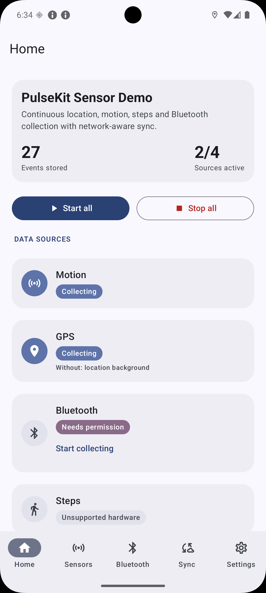
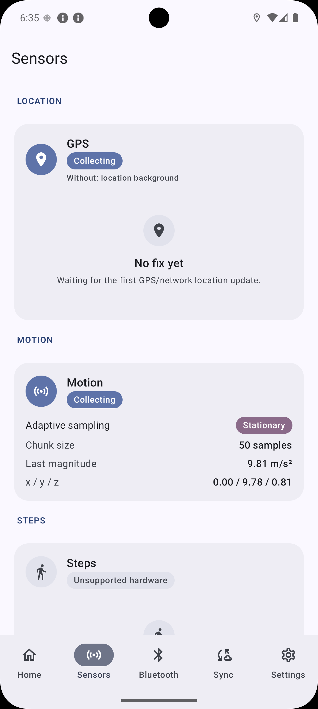
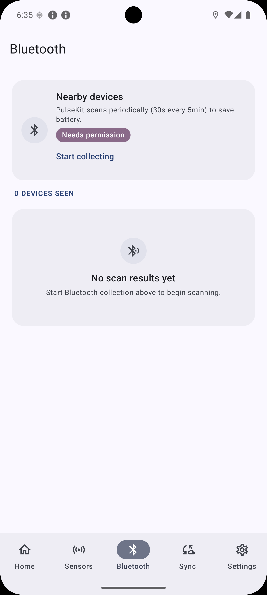
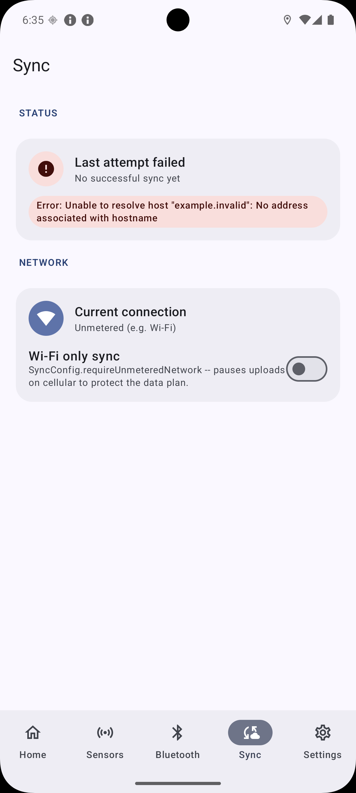
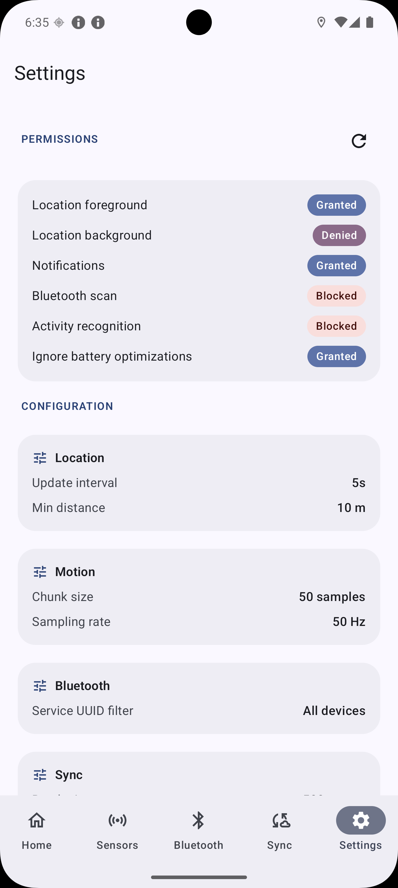

# PulseKit

[](https://github.com/alirezajavan/PulseKit/actions/workflows/test.yml)
[](https://github.com/alirezajavan/PulseKit/actions/workflows/release.yml)
[](https://central.sonatype.com/artifact/io.github.alirezajavan/pulsekit-core)
[](https://android-arsenal.com/api?level=26)
[](LICENSE)

A Kotlin Multiplatform (Android + iOS) engine for continuous or periodic, multi-day background
data collection from any pluggable `DataSource` — location, motion, step count, and BLE scanning
ship out of the box, and adding your own (heart rate, a custom BLE peripheral, an internal sensor)
is a matter of implementing one interface, not touching the core. Collected events get batched
local persistence and a pluggable sync engine that never assumes your backend's wire format. Each
data source describes its own permissions, so the library handles manifest validation,
foreground-service typing, and the permission-request UI for you.

## Screenshots

The demo app (`app/`) showcases every feature area behind bottom navigation:

<table>
  <tr>
    <td align="center"><br/><sub><b>Home</b></sub></td>
    <td align="center"><br/><sub><b>Sensors</b></sub></td>
    <td align="center"><br/><sub><b>Bluetooth</b></sub></td>
    <td align="center"><br/><sub><b>Sync</b></sub></td>
    <td align="center"><br/><sub><b>Settings</b></sub></td>
  </tr>
</table>

## Project Structure

Follows the **Now In Android**-style modular architecture, adapted for Kotlin Multiplatform:

- **`pulsekit-core`**: Tracking engine, SQLDelight-backed batched/bounded persistence, the
  cross-platform `PermissionController` abstraction, and Android foreground-service +
  boot-resume infrastructure.
- **`pulsekit-location`**: GPS/network location `DataSource`.
- **`pulsekit-motion`**: Raw accelerometer `DataSource` and step-counter `DataSource`.
- **`pulsekit-bluetooth`**: BLE scan `DataSource`.
- These three are reference implementations, not a closed set — any `DataSource` you write plugs
  into the same engine (see [Adding a custom data source](#adding-a-custom-data-source)).
- **`pulsekit-sync`**: Inversion-of-control network sync engine (`SyncEngine` handles retry/
  backoff; `SyncUploader` is the contract your app implements for its own backend, with
  `JsonHttpSyncUploader` provided as a ready-made default).
- **`pulsekit-ui`**: Android infrastructure (Services, Receivers) and Jetpack Compose layer over
  `PermissionController`'s staged request flow -- pull this in if you want a ready-made
  `PermissionGate` composable instead of hand-writing the sequencing.
- **`pulsekit-export`**: Pure, streaming-friendly exporters (`NdjsonExporter`, `GpxExporter`,
  `CsvExporter`) that turn a `Flow`/`Sequence` of stored events into NDJSON, GPX 1.1, or CSV without
  materializing the whole table in memory.
- **`pulsekit-testing`**: First-class test artifact for consumers -- `FakeDataSource`,
  `MutableTimeProvider`, `RecordingPulseKitLogger`, and `inMemoryPulseKitDatabase()` so an app can
  drive `PulseKit` deterministically in its own tests without Robolectric.
- **`app`**: Android demo app wiring all of the above together end-to-end.

Feature modules depend only on `pulsekit-core`, never on each other — if you only need location
tracking, you only pull in `pulsekit-core` + `pulsekit-location`.

## Features

- Continuous **or periodic** background collection designed to survive for days: Android
  foreground service with `START_STICKY` + periodically-renewed wake lock, boot-resume via a
  `BroadcastReceiver`; iOS background location as the anchor that keeps motion/BLE sampling alive.
  Per-source `CollectionMode.Periodic(interval, window)` collects in bursts (e.g. scan BLE 30s
  every 5min) for power-sensitive sources.
- **Per-source control**: `startSources(setOf("location"))` / `stopSources(...)` begin or end
  individual sources on demand, with `activeSourceIds: StateFlow<Set<String>>` as an observable,
  UI-bindable single source of truth for what's collecting.
- **Self-describing data sources**: each `DataSource` declares its own `displayName`,
  `requiredPermissions`, and `optionalPermissions`, so the library derives manifest validation,
  foreground-service typing, and the permission-request UI for you — the app never hardcodes which
  permissions a source needs.
- **Pluggable by design, not just by name**: `DataSource` is a four-method interface
  (`start`/`stop`/`events`/permission metadata) with no knowledge of location, motion, or BLE baked
  into `pulsekit-core`. Location/motion/BLE are the shipped reference implementations; a new sensor
  is a new module that implements the interface, wired in the same way as the built-in ones.
- **Batteries-included Android service**: extend `BasePulseKitService`, override only `pulseKit`,
  and get the whole foreground-service lifecycle, a customizable notification, wake-lock renewal,
  and permission-masked service typing for free.
- Batched, bounded local persistence (SQLDelight) — high-frequency sensor bursts are coalesced
  into transactions instead of one write per sample, with a count-based prune cap
  (`PulseKitConfig.maxStoredEvents`) and an optional age-based cap
  (`PulseKitConfig.maxEventAgeMillis`) so an offline device can't grow the database unbounded.
- `PulseKit.eraseAllData()` for right-to-erasure (GDPR/CCPA) requests — unconditionally removes
  every stored row, regardless of sync status, distinct from routine pruning.
- A single cross-platform `PermissionController` that encodes the OS-mandated staged permission
  flows for you: Android's foreground-then-background location sequence (10+ requires this as two
  separate calls) and iOS's when-in-use-then-always progression.
- Sync is entirely inversion-of-control: `SyncEngine` owns claim/retry/backoff, `SyncUploader` is
  the one interface you implement for your own backend's wire format — the library never assumes
  JSON-over-HTTP unless you opt into the provided `JsonHttpSyncUploader`.
- `SyncEngine.observeState(): StateFlow<SyncState>` for a UI-ready sync status (last success time,
  last error, consecutive failure count) instead of guessing at internal retry state.
- A pluggable `PulseKitLogger` (`PulseKit.Builder.logger(...)`, also accepted by `SyncEngine`) so
  you can route PulseKit's internal diagnostics (prune passes, failed uploads) through your own
  Timber/Crashlytics/etc. — silent by default.
- Injectable `TimeProvider`/`IdProvider` (`PulseKit.Builder.timeProvider(...)`/`idProvider(...)`) —
  every timestamp and id in the event log can be driven deterministically in tests instead of by an
  unmockable process-wide clock/UUID singleton. Defaults are byte-for-byte unchanged for existing
  callers.
- A public, read-only event query API: `PulseKit.queryEvents(EventQuery)` /
  `observeEvents(EventQuery)` filter by type and time range with a required `limit` — the sync claim
  path stays the only place that mutates rows, so reads are always safe to call regardless of
  collection or sync state.
- `pulsekit-export`'s `NdjsonExporter`/`GpxExporter`/`CsvExporter` turn queried events straight into
  shareable files — GPX for maps/fitness tools, NDJSON for a full-fidelity dump of every payload
  type, CSV for spreadsheets — each silently skipping payload types it doesn't understand instead of
  throwing on a mixed stream.
- `pulsekit-testing` ships a `FakeDataSource` (scriptable start/stop/events, call-count assertions),
  `MutableTimeProvider`, `RecordingPulseKitLogger`, and `inMemoryPulseKitDatabase()` so consumers can
  unit test their own `PulseKit` integration against real SQL without Robolectric.

## Installation

Add whichever modules you need to your `build.gradle.kts`:

```kotlin
dependencies {
    implementation("io.github.alirezajavan:pulsekit-core:0.3.0")
    implementation("io.github.alirezajavan:pulsekit-location:0.3.0")
    implementation("io.github.alirezajavan:pulsekit-motion:0.3.0")
    implementation("io.github.alirezajavan:pulsekit-bluetooth:0.3.0")
    implementation("io.github.alirezajavan:pulsekit-sync:0.3.0")
    implementation("io.github.alirezajavan:pulsekit-ui:0.3.0") // optional
    implementation("io.github.alirezajavan:pulsekit-export:0.3.0") // optional
    testImplementation("io.github.alirezajavan:pulsekit-testing:0.3.0") // optional
}
```

## Usage

### 1. Build a `PulseKit` instance

```kotlin
val database = createPulseKitDatabase(applicationContext)

val pulseKit = PulseKit.builder(database)
    .addDataSource(LocationDataSource(applicationContext))
    .addDataSource(MotionDataSource(applicationContext))
    .addDataSource(StepCounterDataSource(applicationContext))
    // Periodic sources collect in bursts instead of continuously:
    .addDataSource(
        BluetoothDataSource(applicationContext),
        mode = CollectionMode.Periodic(intervalMillis = 5.minutes.inWholeMilliseconds,
                                       windowMillis = 30.seconds.inWholeMilliseconds),
    )
    .build()
```

Drive collection through the platform host (Android `Service` or iOS `IosPulseKitHost`) to
ensure the app process is kept alive for background collection:

```kotlin
// Android: Start the tracking service
BasePulseKitService.startCollection(context, MyTrackingService::class)

// iOS: Start the keep-alive host
val host = IosPulseKitHost(pulseKit)
host.start()
```

Location/motion data is sensitive (GDPR/CCPA-relevant). By default `createPulseKitDatabase(context)`
uses a plain, unencrypted driver -- if your app needs at-rest encryption, call the
`createPulseKitDatabase(driver: SqlDriver)` overload with your own driver instead, e.g. one
wrapping SQLCipher-for-Android's `SupportOpenHelperFactory`. PulseKit doesn't bundle SQLCipher
itself since there's no equivalent turnkey story on iOS.

### 2. (Android) Define a foreground service

`BasePulseKitService` owns the entire collection lifecycle, wake lock, foreground-service typing
and a default notification — a subclass usually just points it at the shared instance:

```kotlin
class MyTrackingService : BasePulseKitService() {
    override val pulseKit get() = MyApp.from(this).pulseKit

    // Everything below is optional — override to customize the tray notification (or override
    // createForegroundNotification() wholesale for full control):
    override val notificationContentTitle = "Tracking active"
    override val notificationSmallIcon = R.drawable.ic_tracking
}
```

Declare it (and, optionally, a `PulseKitBootReceiver` subclass to resume after reboot) in your
manifest — see [Platform setup](#android) below.

### 3. (iOS) Wrap in a Keep-Alive Host

On iOS, there is no background service. To keep the app alive for continuous sensor collection,
use `IosPulseKitHost` from `pulsekit-ui`:

```kotlin
val host = IosPulseKitHost(pulseKit)
host.start() // Requests 'Always' location and keeps process awake
```

Ensure your `Info.plist` declares the `location` UIBackgroundModes — see [Platform setup](#ios) below.

### 4. (Android) Validate your manifest/service/receiver wiring at startup

`PulseKit.Builder.validateAndroidSetup(...)` cross-checks your app's manifest against the data
sources you've added and throws one exception listing every gap found -- missing permissions, a
service/receiver class that isn't declared as a component, or a `<service>` missing a required
`foregroundServiceType` flag -- instead of letting a setup mistake surface later as an opaque
`SecurityException` from `startForegroundService()`:

```kotlin
pulseKit = PulseKit.builder(database)
    .addDataSource(LocationDataSource(applicationContext))
    .addDataSource(MotionDataSource(applicationContext))
    .addDataSource(StepCounterDataSource(applicationContext))
    .addDataSource(BluetoothDataSource(applicationContext))
    .validateAndroidSetup(
        context = applicationContext,
        serviceClass = MyTrackingService::class,       // your BasePulseKitService subclass
        bootReceiverClass = MyBootReceiver::class,      // optional; your PulseKitBootReceiver subclass
    )
    .build()
```

If your app deliberately has no `BasePulseKitService` subclass, pass `serviceClass = null` (the
default): permission/manifest checks still run, and instead of failing, PulseKit logs a warning
through the builder's configured logger that collection will only work while the app is in the
foreground -- without a foreground service the OS is free to suspend the process (and every
sensor callback with it) as soon as the app is backgrounded.

This only checks *declarations* -- it says nothing about whether the user has actually granted a
permission at runtime. That's `PermissionController`'s job, below.

### 4. Request permissions — the source describes what it needs

You don't enumerate a source's permissions yourself. Each `DataSource` declares its own
`requiredPermissions`/`optionalPermissions`, and `PermissionController` encodes the OS-mandated
staged ordering (foreground location before background, etc.). If your UI is Compose, the
`pulsekit-ui` module turns a source straight into a permission-first flow:

```kotlin
@Composable
fun SourceButton(source: DataSource, controller: PermissionController, onStart: () -> Unit) {
    // Derives the whole staged request (required -> optional -> session permissions) from the
    // source itself — no permission list in your app code.
    val permissions = rememberDataSourcePermissionState(controller, source)

    Button(onClick = {
        permissions.request { canCollect -> if (canCollect) onStart() }
    }) { Text("Collect ${source.displayName}") }

    if (permissions.missingRequired.isNotEmpty()) Text("Needs: ${permissions.missingRequired}")
}
```

`canCollect` is `true` only once every `requiredPermissions` is granted; denied *optional*
permissions (background location, notifications, battery exemption) surface via `missingOptional`
so you can show "collecting without …" instead of blocking. Render one button per
`pulseKit.dataSources` entry and you have the whole screen — see `MainActivity.kt` in `app/`.

Prefer to drive it by hand? `PermissionController.request(Permission.LOCATION_FOREGROUND)` returns
a `PermissionStatus` and handles the staged ordering; `PermissionGate` /
`rememberPermissionGateState` are the lower-level generic building blocks if you want to list
permissions explicitly.

### 5. Sync collected events to your own backend

```kotlin
// Bring your own wire format:
class MyBackendUploader(private val api: MyApiClient) : SyncUploader {
    override suspend fun upload(batch: List<SensorEventLog>): Boolean =
        api.postEvents(batch.map { it.toMyWireFormat() })
}

val syncEngine = SyncEngine(pulseKit.syncSource, MyBackendUploader(api))
syncEngine.start(applicationScope)

// Or, if a simple JSON-over-HTTP endpoint is enough:
val syncEngine = SyncEngine(pulseKit.syncSource, JsonHttpSyncUploader(HttpClient(), endpointUrl))

// Observe sync status for your own UI:
syncEngine.observeState().collect { state ->
    // state.isSyncing, state.lastSuccessTimestampMillis, state.lastError, state.consecutiveFailures
}
```

### 6. Read back and export collected events

`PulseKit` exposes a read-only query API alongside the sync claim path — reading never mutates
`syncStatus`, so it's safe to call whether or not anything is currently collecting or syncing:

```kotlin
val query = EventQuery(
    types = setOf("location"),          // null = every source
    fromTimestamp = oneHourAgoMillis,
    toTimestamp = System.currentTimeMillis(),
    limit = 500,                        // required — no unbounded query on a large table
)

val recent: List<SensorEventLog> = pulseKit.queryEvents(query)
val liveFeed: Flow<List<SensorEventLog>> = pulseKit.observeEvents(query)
```

`pulsekit-export` turns a `Flow`/`Sequence` of events into a shareable file without materializing
the whole table in memory — pick the format that fits the consumer:

```kotlin
val events = pulseKit.queryEvents(query).asFlow()

NdjsonExporter.export(events, output)  // one SensorEventLog per line, every payload type
GpxExporter.export(events, output)     // GPX 1.1 <trk>, Location rows only
CsvExporter.export(events, output)     // flattened Location/StepCount rows; MotionChunk expands
                                        // to one row per sample
```

Mixed-type streams are handled gracefully: `GpxExporter`/`CsvExporter` silently skip payload types
they don't understand instead of throwing, and an empty result set still produces a well-formed
(if empty) document. See `HistoryScreen.kt` in `app/` for the full share-as-file flow.

### 7. Test your integration with `pulsekit-testing`

`pulsekit-testing` ships fakes for the pieces of `PulseKit` a test needs to control, so your app's
tests can drive real `PulseKit` orchestration deterministically without Robolectric:

```kotlin
val timeProvider = MutableTimeProvider(initialMillis = 1000L)
val logger = RecordingPulseKitLogger()
val source = FakeDataSource(id = "fake")

val pulseKit = PulseKit.builder(inMemoryPulseKitDatabase())
    .addDataSource(source)
    .timeProvider(timeProvider)
    .logger(logger)
    .build()

pulseKit.start()
source.emit(SensorPayload.StepCount(steps = 10))
timeProvider.advanceBy(5_000)

// source.getStartCount() / source.isRunning() assert the "safe to call again" DataSource contract;
// inMemoryPulseKitDatabase() returns a fresh, isolated in-memory database on every call.
```

See `PulseKitShowcaseTest` under `app/src/test/` for the pattern end-to-end.

### 8. Adding a custom data source

`pulsekit-location`, `pulsekit-motion`, and `pulsekit-bluetooth` are reference implementations —
`pulsekit-core` has no knowledge of any of them. Anything that can produce a stream of values on a
schedule can become a `DataSource`:

```kotlin
class HeartRateDataSource(private val sensorManager: SensorManager) : DataSource {
    override val id = "heart_rate"
    override val displayName = "Heart Rate"
    override val requiredPermissions = listOf(Permission.BODY_SENSORS)

    private val _events = MutableSharedFlow<SensorPayload>(extraBufferCapacity = 16)

    override suspend fun start(): Boolean {
        // register your sensor listener, emit into _events
        return true
    }

    override suspend fun stop() { /* unregister listener */ }

    override fun events(): Flow<SensorPayload> = _events
}
```

Register it exactly like a built-in source — `PulseKit.builder(database).addDataSource(HeartRateDataSource(sensorManager))`
— and it gets manifest validation, foreground-service typing, and permission-request UI for free,
the same as `LocationDataSource` or `BluetoothDataSource`. If it needs a new `Permission` that
doesn't exist yet, see [Adding a new `Permission`](CLAUDE.md#adding-a-new-permission) in `CLAUDE.md`.

## Platform setup

### Android

PulseKit follows a **Zero-Manifest** policy. Library modules do not declare any permissions or
components in their own manifests. Your app **must** explicitly declare everything it needs in its
`AndroidManifest.xml`:

- **Infrastructure**: `FOREGROUND_SERVICE`, `WAKE_LOCK`, `POST_NOTIFICATIONS`, `RECEIVE_BOOT_COMPLETED`.
- **Permissions**: Every permission required by your data sources (e.g., `ACCESS_FINE_LOCATION`,
  `ACTIVITY_RECOGNITION`, `FOREGROUND_SERVICE_LOCATION`).
- **Components**: Your `BasePulseKitService` subclass and `PulseKitBootReceiver` subclass.

Use `pulseKit.validateAndroidSetup(...)` from `pulsekit-ui` at startup to catch any missing
manifest declarations early with a descriptive error.

### iOS

There's no `iosApp`/`Info.plist` in this repo — those live in your consuming app. Add:

- `NSLocationWhenInUseUsageDescription` and `NSLocationAlwaysAndWhenInUseUsageDescription`
- `NSMotionUsageDescription`
- A `UIBackgroundModes` array containing `location` (this is what keeps motion/BLE sampling alive
  in the background too — there's no separate background mode for them on iOS)

## Contributing

`./gradlew build` runs the full verification suite (all KMP targets, unit tests, API compatibility
check). A pre-commit hook is provided for fast local checks before every commit:

```sh
git config core.hooksPath scripts/git-hooks
```

See `CLAUDE.md` for architecture conventions and `REFACTOR_PLAN.md` for the current roadmap.

## License

Apache License 2.0 — see [LICENSE](LICENSE).
